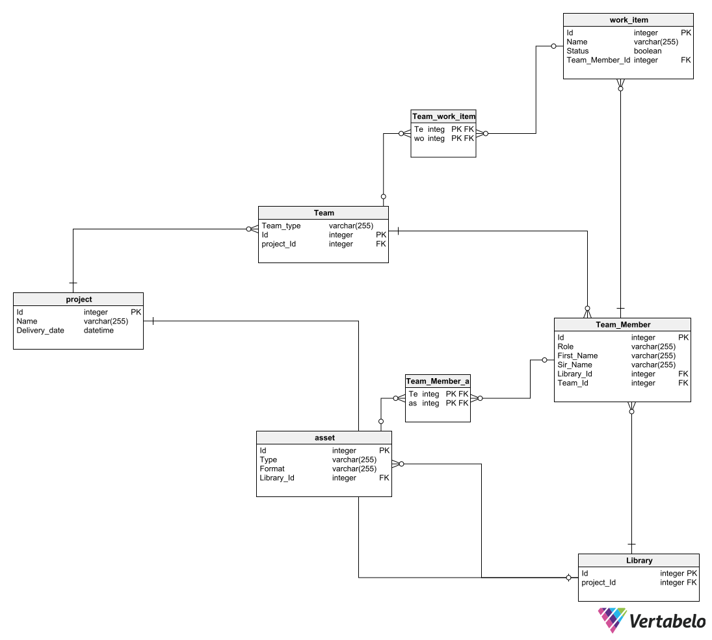

```{r setup, include=FALSE}
## Clear console on each execute and set chunk default to not show code
cat('\014')
#knitr::opts_chunk$set(include = FALSE)
```


```{r include=FALSE}
## Download and load libraries
 if(!require("RSQLite"))
   install.packages("RSQLite")

 if(!require("DBI"))
   install.packages("DBI")

 if(!require("dplyr"))
   install.packages("dplyr")

library(RSQLite)
library(DBI)
library(dplyr)
```


```{r include=FALSE}
## Establish a connection to the MySQL DB

conn = dbConnect(RSQLite::SQLite(),
                            dbname= "daie_ca4_data.sqlite")
```


```{r include=FALSE}
## Create project table
# dbExecute(conn, "CREATE TABLE project (
#    Id integer NOT NULL CONSTRAINT project_pk PRIMARY KEY,
#    Name varchar(255) NOT NULL,
#    Delivery_date datetime NOT NULL)", overwrite = T, append = T)

## Create work_item table
# dbExecute(conn, "CREATE TABLE work_item (
#     Id integer NOT NULL CONSTRAINT work_item_pk PRIMARY KEY,
#     Name varchar(255) NOT NULL,
#     Status boolean NOT NULL,
#     Team_Member_Id integer NOT NULL,
#     CONSTRAINT work_item_Team_Member FOREIGN KEY (Team_Member_Id)
#     REFERENCES Team_Member (Id)
# )")


## Create Table: asset
# dbExecute(conn, "CREATE TABLE asset (
#     Id integer NOT NULL CONSTRAINT asset_pk PRIMARY KEY,
#     Type varchar(255) NOT NULL,
#     Format varchar(255) NOT NULL,
#     Library_Id integer NOT NULL,
#     CONSTRAINT asset_library FOREIGN KEY (Library_Id)
#     REFERENCES Library (Id)
# )" )


## Table: Team_work_item
# dbExecute(conn, "CREATE TABLE Team_work_item (
#     Team_Id integer NOT NULL,
#     work_item_Id integer NOT NULL,
#     CONSTRAINT Team_work_item_pk PRIMARY KEY (Team_Id,work_item_Id),
#     CONSTRAINT Team_work_item_Team FOREIGN KEY (Team_Id)
#     REFERENCES Team (Id),
#     CONSTRAINT Team_work_item_work_item FOREIGN KEY (work_item_Id)
#     REFERENCES work_item (Id)
# )" )


## Table: Team_Member_asset
# dbExecute(conn, "CREATE TABLE Team_Member_asset (
#     Team_Member_Id integer NOT NULL,
#     asset_Id integer NOT NULL,
#     CONSTRAINT Team_Member_asset_pk PRIMARY KEY (Team_Member_Id,asset_Id),
#     CONSTRAINT Team_Member_asset_Team_Member FOREIGN KEY (Team_Member_Id)
#     REFERENCES Team_Member (Id),
#     CONSTRAINT Team_Member_asset_asset FOREIGN KEY (asset_Id)
#     REFERENCES asset (Id)
# )" )


## Table: Team_Member
# dbExecute(conn, "CREATE TABLE Team_Member (
#     Id integer NOT NULL CONSTRAINT Team_Member_pk PRIMARY KEY,
#     Role varchar(255) NOT NULL,
#     First_Name varchar(255) NOT NULL,
#     Sir_Name varchar(255) NOT NULL,
#     Library_Id integer NOT NULL,
#     Team_Id integer NOT NULL,
#     CONSTRAINT Team_Member_Library FOREIGN KEY (Library_Id)
#     REFERENCES Library (Id),
#     CONSTRAINT Team_Member_Team FOREIGN KEY (Team_Id)
#     REFERENCES Team (Id)
# )" )

## Table: Team
# dbExecute(conn, "CREATE TABLE Team (
#     Team_type varchar(255) NOT NULL,
#     Id integer NOT NULL CONSTRAINT Team_pk PRIMARY KEY,
#     project_Id integer NOT NULL,
#     CONSTRAINT Team_project FOREIGN KEY (project_Id)
#     REFERENCES project (Id)
# )" )


## Table: Library
# dbExecute(conn, "CREATE TABLE Library (
#     Id integer NOT NULL CONSTRAINT Library_pk PRIMARY KEY,
#     project_Id integer NOT NULL,
#     CONSTRAINT Library_project FOREIGN KEY (project_Id)
#     REFERENCES project (Id)
# )" )


```


```{r}

# Check what tables exist in the data base
dbListTables(conn)
# Check what fields exist in the table
dbListFields(conn, "Library")
dbListFields(conn, "Team")
dbListFields(conn, "Team_Member")
dbListFields(conn, "Team_Member_asset")
dbListFields(conn, "Team_work_item")
dbListFields(conn, "asset")
dbListFields(conn, "project")
dbListFields(conn, "work_item")
 
 
 

```




# Inserts into project table

```{r}
# dbExecute(conn, 'INSERT INTO project (Id, Name, Delivery_date)
# VALUES (1001, "Zombie Nation", "2024-07-22 00:00:00")  
# ')

# dbExecute(conn, 'INSERT INTO project (Id, Name, Delivery_date)
# VALUES (1002, "Zombie Nation 2", "2025-07-22 00:00:00")
# ')

# dbExecute(conn, 'INSERT INTO project (Id, Name, Delivery_date)
# VALUES (1003, "Duty of Combat: Special Ops", "2026-07-22 00:00:00")
# ')

# dbExecute(conn, 'INSERT INTO project (Id, Name, Delivery_date)
# VALUES (1004, "Zombie Nation 3", "2027-07-22 00:00:00")
# ')
# 
# dbExecute(conn, 'INSERT INTO project (Id, Name, Delivery_date)
# VALUES (1005, "Duty of Combat: Future Warfare", "2028-07-22 00:00:00")
# ')
# 
# dbExecute(conn, 'INSERT INTO project (Id, Name, Delivery_date)
# VALUES (1006, "Zombie Nation 3: Special Edition", "2029-07-22 00:00:00")
# ')
# 
# dbExecute(conn, 'INSERT INTO project (Id, Name, Delivery_date)
# VALUES (1007, "Duty of Combat: Special Ops 2", "2030-07-22 00:00:00")
# ')

# dbExecute(conn, 'UPDATE project SET Delivery_date = "2026-04-22 00:00:00" WHERE Id = 1003')

dbGetQuery(conn, "SELECT * FROM project")
```

# Inserts into Team table

```{r}
# dbExecute(conn, 'INSERT INTO Team (Team_type, Id, project_Id)
# VALUES ("Game Developers", 2001, 1001)
# ')

# dbExecute(conn, 'INSERT INTO Team (Team_type, Id, project_Id)
# VALUES ("Animators", 3001, 1002)
# ')
# 
# dbExecute(conn, 'INSERT INTO Team (Team_type, Id, project_Id)
# VALUES ("Testers", 4001, 1003)
# ')

# dbExecute(conn, 'INSERT INTO Team (Team_type, Id, project_Id)
# VALUES ("Concept Artists", 5001, 1002)
# ')
# 
# dbExecute(conn, 'INSERT INTO Team (Team_type, Id, project_Id)
# VALUES ("Designers", 6001, 1002)
# ')

# dbExecute(conn, 'UPDATE Team SET project_Id = 1003 WHERE Id = 4001')

dbGetQuery(conn, "SELECT * FROM Team")

```

# Inserts into Team_Member table

```{r}
# dbExecute(conn, 'INSERT INTO Team_Member (Id, Role, First_Name, Sir_Name, Library_Id, Team_Id)
#  VALUES (1111, "Project Manager", "Shane", "Cunningham", 1, 2001)
#  ')

# dbExecute(conn, 'INSERT INTO Team_Member (Id, Role, First_Name, Sir_Name, Library_Id, Team_Id)
#  VALUES (1112, "Junior Dev", "Jack", "Cunningham", 1, 2001)
#  ')
# 
# dbExecute(conn, 'INSERT INTO Team_Member (Id, Role, First_Name, Sir_Name, Library_Id, Team_Id)
#  VALUES (1113, "Senior Dev", "Tricia", "Dilworth", 1, 2001)
#  ')
# 
# dbExecute(conn, 'INSERT INTO Team_Member (Id, Role, First_Name, Sir_Name, Library_Id, Team_Id)
#  VALUES (1114, "Lead Animator", "Dave", "Burne", 2, 3001)
#  ')
# 
# dbExecute(conn, 'INSERT INTO Team_Member (Id, Role, First_Name, Sir_Name, Library_Id, Team_Id)
#  VALUES (1115, "Lead Tester", "Harry", "Keane", 3, 4001)
# ')

dbGetQuery(conn, "SELECT * FROM Team_Member")

```

# Inserts into asset table

```{r}
# dbExecute(conn, 'INSERT INTO asset (Id, Type, Format, Library_Id)
#           VALUES (19832,"Game physics/ Programming, Zombie Nation", "C++", 1)')
# 
# dbExecute(conn, 'INSERT INTO asset (Id, Type, Format, Library_Id)
#           VALUES (11342,"Character functions/ Programming, Zombie Nation", "C++", 1)')
# 
# dbExecute(conn, 'INSERT INTO asset (Id, Type, Format, Library_Id)
#           VALUES (15026,"Backend API Testing, Zombie Nation", "C++", 1)')
# 
# 
# dbExecute(conn, 'INSERT INTO asset (Id, Type, Format, Library_Id)
#           VALUES (28785, "Animation/ Level design, Zombie Nation 2", "JPG", 2)')
# 
# dbExecute(conn, 'INSERT INTO asset (Id, Type, Format, Library_Id)
#           VALUES (37152, "Testing, Duty of Combat: Special Ops", "C++", 3)')

# dbExecute(conn, 'DELETE FROM asset
# WHERE Id = 28785;')

dbGetQuery(conn, "SELECT * FROM asset")

```

# Inserts into Team_Member_asset table

```{r}
# dbExecute(conn, 'INSERT INTO Team_Member_asset (Team_Member_Id, asset_Id)
#           VALUES (1111, 19832)')
# 
# dbExecute(conn, 'INSERT INTO Team_Member_asset (Team_Member_Id, asset_Id)
#           VALUES (1112, 11342)')
# 
# dbExecute(conn, 'INSERT INTO Team_Member_asset (Team_Member_Id, asset_Id)
#           VALUES (1113, 15026)')
# 
# dbExecute(conn, 'INSERT INTO Team_Member_asset (Team_Member_Id, asset_Id)
#           VALUES (1114, 28785)')
# 
# dbExecute(conn, 'INSERT INTO Team_Member_asset (Team_Member_Id, asset_Id)
#           VALUES (1115, 37152)')

dbGetQuery(conn, "SELECT * FROM Team_Member_asset")

```

# Inserts into work_item table

```{r}

# dbExecute(conn, 'INSERT INTO work_item (Id, Name, Status, Team_Member_Id)
#           VALUES (88986, "Project Management", TRUE, 1111)')

# dbExecute(conn, 'INSERT INTO work_item (Id, Name, Status, Team_Member_Id)
#           VALUES (88640, "Features / Frontend", TRUE, 1112)')
# 
# dbExecute(conn, 'INSERT INTO work_item (Id, Name, Status, Team_Member_Id)
#           VALUES (82150, "Backend Development", TRUE, 1113)')
# 
# dbExecute(conn, 'INSERT INTO work_item (Id, Name, Status, Team_Member_Id)
#           VALUES (86467, "3D Animation & Game Engine Pipeline", TRUE, 1114)')
# 
# dbExecute(conn, 'INSERT INTO work_item (Id, Name, Status, Team_Member_Id)
#           VALUES (81071, "Testing", TRUE, 1115)')


dbGetQuery(conn, "SELECT * FROM work_item")

```

# Inserts into Team_work_item table

```{r}

# dbExecute(conn, 'INSERT INTO Team_work_item (Team_Id, work_item_Id)
# VALUES (2001, 88986)')
# 
# dbExecute(conn, 'INSERT INTO Team_work_item (Team_Id, work_item_Id)
# VALUES (2001, 88640)')
# 
# dbExecute(conn, 'INSERT INTO Team_work_item (Team_Id, work_item_Id)
# VALUES (2001, 82150)')
# 
# dbExecute(conn, 'INSERT INTO Team_work_item (Team_Id, work_item_Id)
# VALUES (3001, 86467)')
# 
# dbExecute(conn, 'INSERT INTO Team_work_item (Team_Id, work_item_Id)
# VALUES (4001, 81071)')

dbGetQuery(conn, "SELECT * FROM Team_work_item")

```

# Inserts into Library table

```{r}

# dbExecute(conn, 'INSERT INTO Library (Id, project_Id)
#           VALUES (1, 1001 )')
# 
# dbExecute(conn, 'INSERT INTO Library (Id, project_Id)
#           VALUES (2, 1002)')
# 
# dbExecute(conn, 'INSERT INTO Library (Id, project_Id)
#           VALUES (3, 1003)')

dbGetQuery(conn, "SELECT * FROM Library")

```


```{r include=FALSE}

dbDisconnect(conn) 

```


# Bibliography

admin (2019) UPDATE Query in SQLite, W3schools. Available at: https://www.w3schools.blog/update-query-sqlite (Accessed: 18 January 2023).

Bhalla, D. (no date) ‘dplyr Tutorial : Data Manipulation (50 Examples)’, ListenData. Available at: https://www.listendata.com/2016/08/dplyr-tutorial.html (Accessed: 10 December 2022).
Datatypes In SQLite (no date). Available at: https://www.sqlite.org/datatype3.html (Accessed: 18 January 2023).

Execute a data manipulation statement on a given database connection — dbSendStatement (no date). Available at: https://dbi.r-dbi.org/reference/dbsendstatement (Accessed: 18 January 2023).

How to use DATETIME value in SQLite? (2018) TablePlus. Available at: https://tableplus.com/blog/2018/07/sqlite-how-to-use-datetime-value.html (Accessed: 18 January 2023).

[R beginners]: Use  RSQLite, a fast and easy database in R (2020). Available at: https://www.youtube.com/watch?v=GYfmN2IeY1w (Accessed: 16 January 2023).

R Markdown for a Data Analysis Report (2016). Available at: https://www.youtube.com/watch?v=0bxa7rkur9o (Accessed: 7 December 2022).

R programming for beginners – statistic with R (t-test and linear regression) and dplyr and ggplot (2017). Available at: https://www.youtube.com/watch?v=ANMuuq502rE (Accessed: 20 December 2022).

R SQLite Database Tutorial (no date). Available at: https://www.datacamp.com/tutorial/sqlite-in-r (Accessed: 18 January 2023).

Riederer, Y.X., Christophe Dervieux, Emily (no date) How to read this book | R Markdown Cookbook. Available at: https://bookdown.org/yihui/rmarkdown-cookbook/how-to-read-this-book.html (Accessed: 10 December 2022).

‘rmarkdown-cheatsheet’ (no date).
Solutions - SQLite (NA). Available at: https://solutions.posit.co/connections/db/databases/sqlite/ (Accessed: 18 January 2023).

SQL BETWEEN Operator (no date). Available at: https://www.w3schools.com/sql/sql_between.asp (Accessed: 19 January 2023).

SQL INNER JOIN Keyword (no date). Available at: https://www.w3schools.com/sql/sql_join_inner.asp (Accessed: 19 January 2023).

SQL ORDER BY Keyword (no date). Available at: https://www.w3schools.com/sql/sql_orderby.asp (Accessed: 19 January 2023).

SQL SELECT DISTINCT Statement (no date). Available at: https://www.w3schools.com/sql/sql_distinct.asp (Accessed: 19 January 2023).

SQL Subquery – How to Sub Query in SELECT Statement (2022) freeCodeCamp.org. Available at: https://www.freecodecamp.org/news/sql-subquery-how-to-sub-query-in-select-statement/ (Accessed: 19 January 2023).

SQLite Home Page (no date). Available at: https://www.sqlite.org/index.html (Accessed: 18 January 2023).
